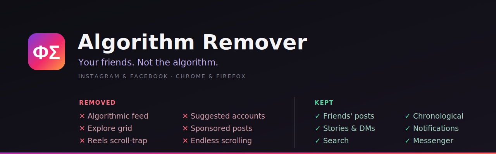

  

  
  
  
  

# Algorithm Remover — Instagram & Facebook

A tiny browser extension that keeps the parts of Instagram and Facebook you
actually came for — friends' posts, stories, DMs/Messenger, and search — and
strips the parts engineered to keep you scrolling. No tracking, no accounts, no
build step, no dependencies: just a handful of content scripts.

> **This is not an ad blocker.** It removes the *algorithm* — ranked feeds, the
> Explore grid, Reels infinite-scroll, suggested accounts — not ads. Pair it
> with a dedicated ad blocker if you want ads gone too.

## What it does

### Instagram
- **Home feed** → suggested and sponsored posts are hidden, so what's left is the
  accounts you follow. Your **stories tray stays** — Instagram's web has no
  chronological view that also keeps stories, so we leave the normal feed in
  place (Instagram's own ordering) rather than lose them.
- **Suggested accounts** → the right-rail "Suggested for you" **accounts** block
  (and the same carousel on profiles) is removed.
- **Explore** → the endless media grid is removed, leaving just the search bar.
  You can still search up accounts and hashtags — only the video/photo grid is gone.
- **Reels** → a reel a friend sends still opens and plays, but you **can't
  advance** past it: scroll wheel, trackpad swipe, arrow/space keys, and the
  next/previous buttons are all disabled, and the Reels nav button is removed.
  Comments still scroll.
- **Untouched:** DMs (including reels played inside a chat), stories,
  notifications, profiles, search.

### Facebook
- **Home feed** → redirected to the chronological **Feeds** view (`?sk=h_chr`):
  friends, pages, and groups you follow, in time order. Re-applied when you click
  Home (Facebook otherwise snaps back to its ranked feed).
- Hides "Suggested for you", "People you may know", and "Reels and short videos"
  units, plus best-effort in-feed Sponsored ads.
- Hides the left-nav Reels, Gaming, and Watch entry points.
- **Untouched:** Messenger, groups, events, marketplace, profiles, notifications.

## Install

### Chrome / Edge / Brave
1. Download this repo — green **Code → Download ZIP**, then unzip (or `git clone`).
2. Open `chrome://extensions` and turn on **Developer mode** (top-right).
3. Click **Load unpacked** and select the folder.

### Firefox
Firefox only runs signed add-ons on the release build, and this needs
**Firefox 127 or newer**. Signing is free via Mozilla:
- **Sign it once (~10 min):** grab the `.zip` from [Releases](https://github.com/Hexaphobic/algorithm-remover/releases)
  (or zip the repo's *contents* — files at the zip root, not the folder) and
  upload it at [addons.mozilla.org](https://addons.mozilla.org) → Developer Hub →
  Submit → **"On your own"** (unlisted). You get a signed `.xpi` back; open it in
  Firefox and it stays installed.
- **Quick temporary test:** `about:debugging` → **Load Temporary Add-on** → pick
  `manifest.json`. One gotcha — temporary add-ons don't get site access
  automatically: open `about:addons` → this extension → **Permissions** and enable
  access for instagram.com and facebook.com.

## The toolbar button

Click the extension's icon for a small **About** card linking to this repository.

There's no custom on/off control — and no `storage` (or any other) permission is
requested. To pause it, just switch the extension off in your browser's
Extensions menu (the puzzle-piece icon → Manage); flip it back on any time.

## How it works

Three layers, laziest first — and crucially, **it never relies on Meta's
scrambled CSS class names**:

1. **Redirect** Facebook's home to its *own* chronological Feeds view — robust,
   because Meta maintains it. (Instagram's equivalent chronological view drops the
   stories tray, so there we keep the normal feed and lean on step 2 instead.)
2. **Hide** the junk by page structure, element role, `href`, and short visible
   labels — the hooks that survive Meta's churn. On Instagram this is the main
   mechanism: suggested/sponsored posts and suggested accounts are removed.
3. **Block** Reels advancement by intercepting scroll / swipe / key events, which
   works no matter how the DOM is shaped.

The upshot: when Meta reshuffles their markup, repairs are one-line edits to a
list of strings or a selector, never a rewrite.

## Known limitations

- **English UI only.** Detection strings assume English. For another language,
  translate the phrases in the `FEED_NEEDLES` / `TEXT_NEEDLES` arrays; the
  redirects and Reels blocking are language-independent.
- **Facebook ads are best-effort.** Facebook scrambles the word "Sponsored" so it
  can't be matched as text; the extension identifies ads by their ad-rendering
  markup instead, which Facebook could rename. (It's not an ad blocker — see the
  note up top.)
- **Meta ships UI changes constantly.** If something breaks, it's usually a
  one-line fix — see below.

## Fixing it when Meta changes their markup

- **A "Suggested"/"Sponsored" wording slips through** → add the exact phrase to
  the `FEED_NEEDLES` (Instagram) or `TEXT_NEEDLES` (Facebook) array.
- **A Reels chevron still advances** → the scroll/key blocking is the real guard,
  but to hide the button too: right-click it → Inspect → copy its `aria-label`,
  and add it to the reels rule in `instagram.css`.
- **The Explore grid reappears** → confirm the page path is still `/explore/`
  (the rule keys on it).
- **Facebook ads reappear** → the ad marker (`data-ad-rendering-role`) was
  probably renamed; the durable fix is reading Facebook's internal
  `category` (SPONSORED vs ORGANIC) via a page-context script.

## Project layout

| File | Purpose |
|------|---------|
| `manifest.json` | MV3 manifest — content scripts + popup, no background script |
| `common.js` | Shared helpers: SPA-nav watcher, redirect enforcer, hide helpers |
| `instagram.js` / `instagram.css` | Instagram behavior |
| `facebook.js` / `facebook.css` | Facebook behavior |
| `popup.html` | Toolbar About popup (links to this repo) |
| `icons/` | Toolbar icons |

## License

[MIT](LICENSE) — do whatever you like with it.
